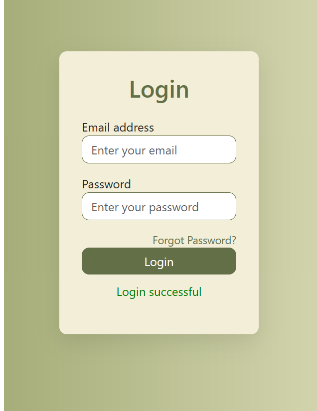

# 🌟 Login Project

Welcome to the **Login Project** repository! This project features a simple and secure user login interface. It is designed with responsiveness, aesthetics, and functionality in mind. 🚀

  

---

## 🔥 Features

✨ **Responsive Design**: Works seamlessly on all device sizes.  
🔒 **Login Validation**: Simulated client-side authentication.  
⚡ **Dynamic UI**: Clean and modern design for a great user experience.

---

## 🎯 Live Demo

👉 **[Live Demo](https://gulzaralice1.github.io/login/)**  
📋 **Credentials for Testing**:  
- **Username**: `admin`  
- **Password**: `admin`  

---

## 🛠️ Technologies Used

- **HTML5**: Structuring the layout.  
- **CSS3**: Styling and enhancing visual appeal.  
- **JavaScript**: Handling form validation and interactions.

---

## 🚀 Getting Started

### Prerequisites

Ensure you have the following tools:

- A web browser (Chrome, Firefox, Edge, etc.).
- [Git](https://git-scm.com/) for cloning the repository (optional).

### Installation

1. **Clone the repository:**
   ```bash
   git clone https://github.com/Gulzaralice1/login.git
